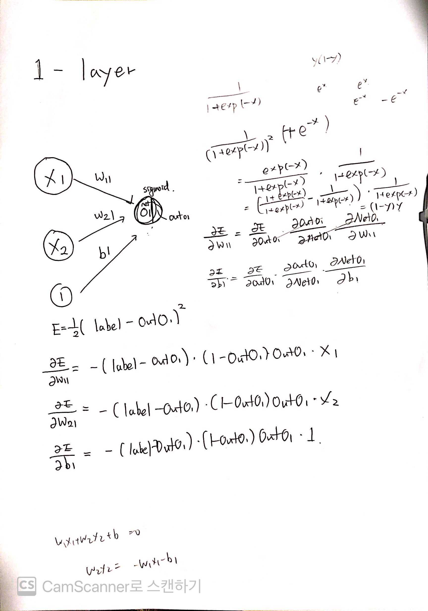
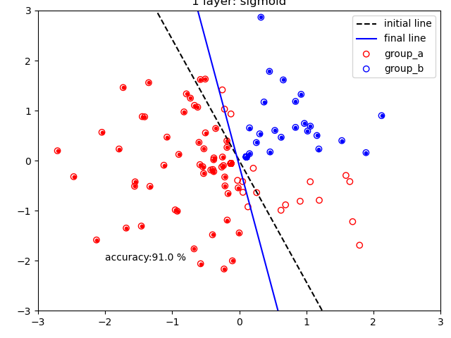
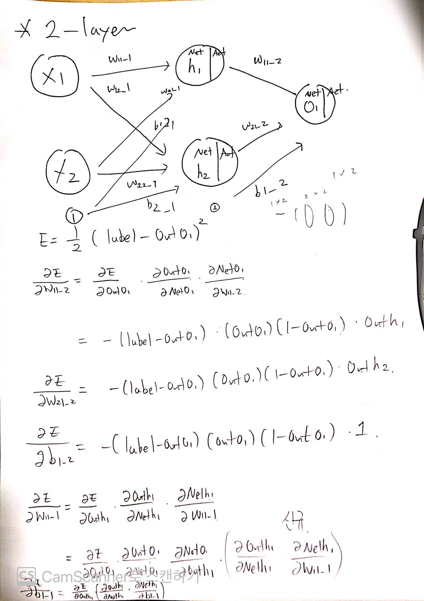
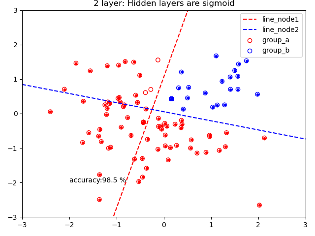
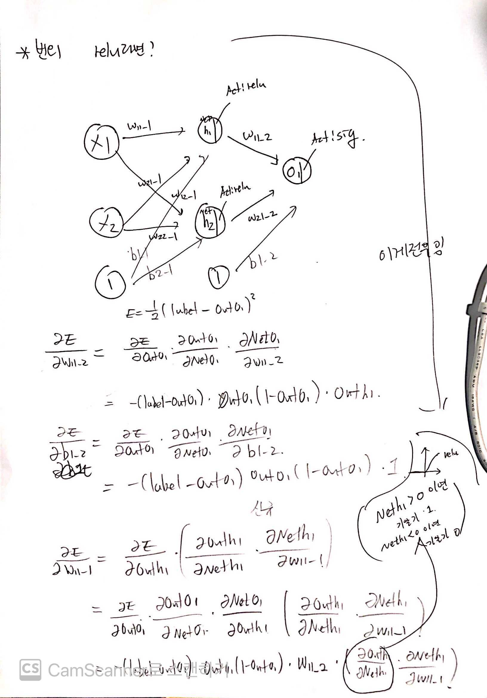
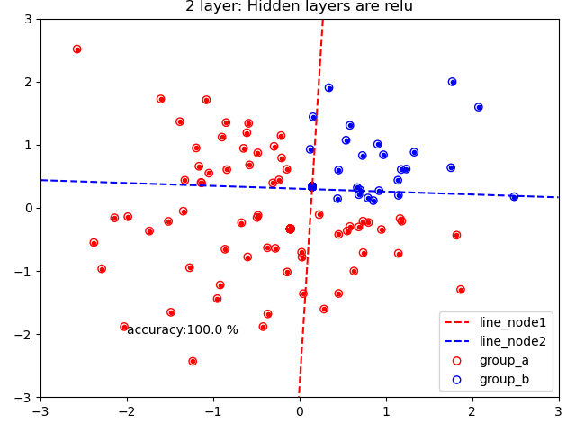
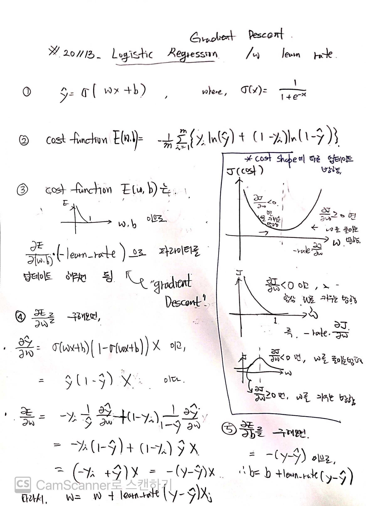

## This Project is for stduy of the back propagation with chain-rule

- reference:

1. [Ref1](http://excelsior-cjh.tistory.com/171)
2. [Ref2](https://bskyvision.com/718)

- I recommand that to read and write , so that make it yours.., It looks simple but, hard to fully understand

# STEP1: onelayer_with_sigmoid

# STEP2: twolayer_with_sigmoid

how to implement the backpropagtion to hidden layer that is compose of sigmoid

# STEP3: two_with_relu

relu looks different and more powerful (not vanishing gradinet!)

# what is cross-entropy

## THE SOURCE file is

1. onelayer_backpropa_study.py
2. twolayer_backpropa_study.py

# enjoy code
